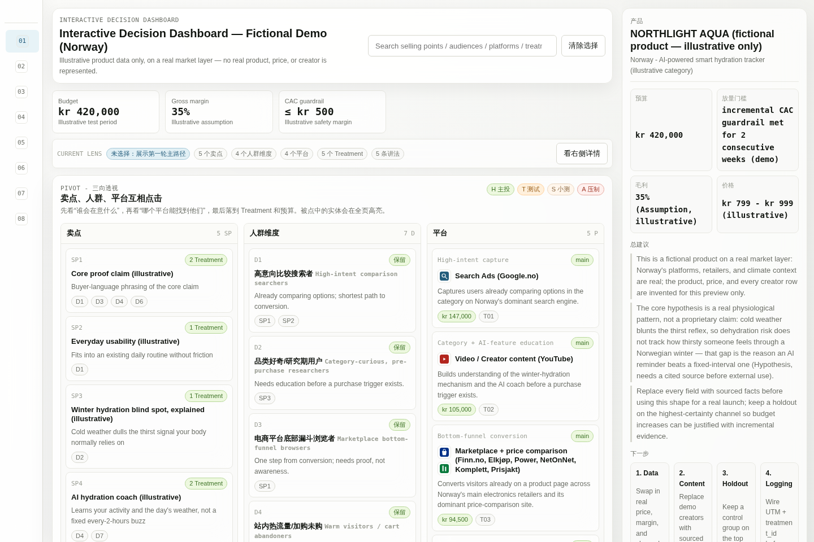
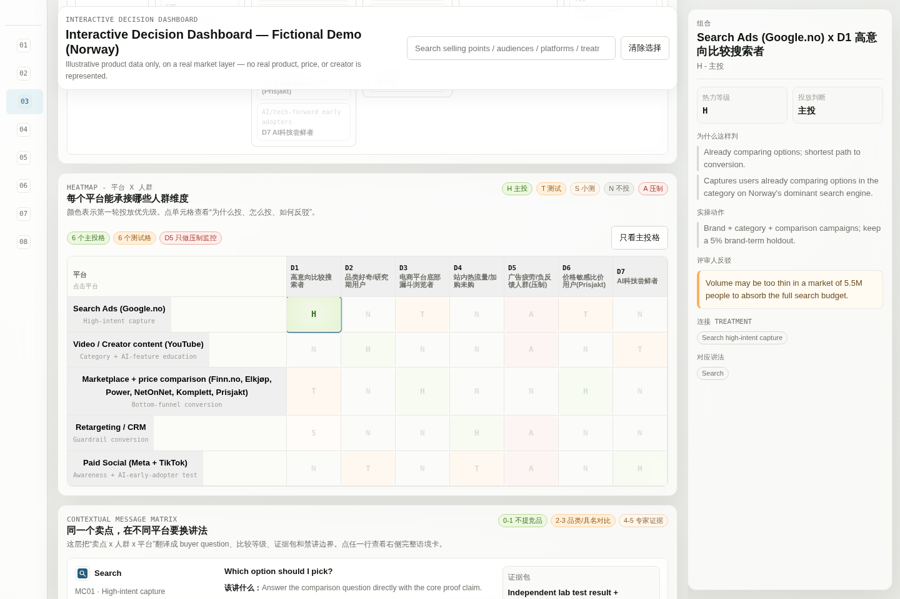
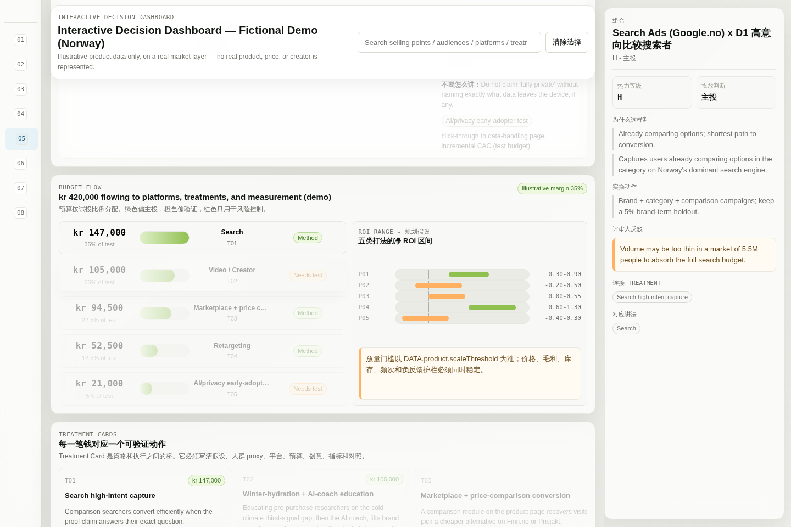
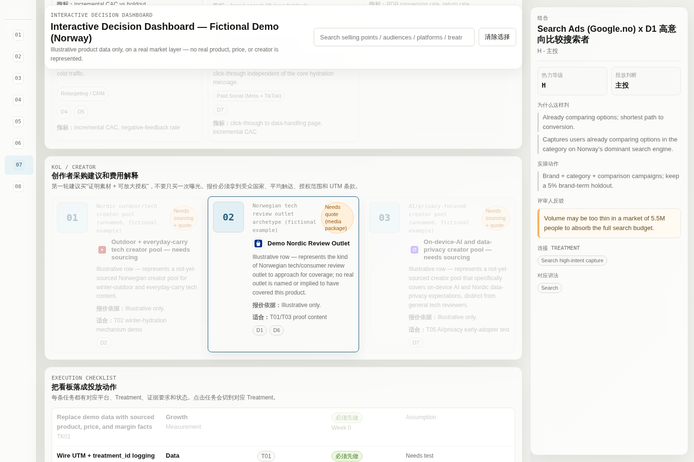

<div align="center">

# Scientific Marketing

**An agent skill collection for causal, AI-assisted marketing decisions.**

<p align="center">
  
  
  
  
</p>

<p align="center">
  <a href="#quickstart">Quickstart</a> |
  <a href="#what-it-does">What it does</a> |
  <a href="#skill-catalog">Skill catalog</a> |
  <a href="#what-the-dashboard-looks-like">Dashboard preview</a> |
  <a href="#how-it-works">How it works</a> |
  <a href="#when-to-use-it">When to use it</a>
</p>

<p align="center">English | <a href="README.zh-CN.md">简体中文</a></p>

</div>

Scientific Marketing turns a product, market, audience, channel, or campaign question into an evidence-labeled marketing plan: traditional marketing structure, AI-assisted insight work, causal personalization, measurement, platform execution, creator procurement, and output quality control.

It is designed for agents that can load local `SKILL.md` files and references on demand.

> **Packaging note:** this repository contains the reusable skills only. Generated examples, local HTML reports, tests, scratch files, and demo outputs are intentionally excluded.

## Quickstart

Clone the repository:

```bash
git clone https://github.com/alexwang91/Scientific-Marketing.git
cd Scientific-Marketing
```

Install into Codex skills on Windows PowerShell:

```powershell
New-Item -ItemType Directory -Force "$env:USERPROFILE\.codex\skills" | Out-Null
Copy-Item -Recurse -Force .\skills\* "$env:USERPROFILE\.codex\skills\"
```

Install into Codex skills on macOS or Linux:

```bash
mkdir -p ~/.codex/skills
cp -R skills/* ~/.codex/skills/
```

Install into a Claude Code style workspace:

```bash
mkdir -p .claude/skills
cp -R skills/* .claude/skills/
```

Then ask your agent:

```text
Use Scientific Marketing. I have a product, price, selling points, and target country.
Build a causal marketing plan with audience dimensions, platform activation, KOL options,
budget split, measurement plan, and execution gates.
```

## What It Does

| Capability | What the agent should produce |
|------------|-------------------------------|
| **Traditional marketing core** | STP, 4P, 5C, funnel, GTM, pricing, CRM, channel, and brand-equity framing. |
| **Market and consumer diagnosis** | Category diagnosis, JTBD, user-language extraction, buying triggers, barriers, and substitutes. |
| **AI marketing intelligence** | Market radar, insight mining, synthetic-consumer hypotheses, creative lab, and agentic operations. |
| **Causal personalization** | Treatment libraries, uplift/HTE/CATE hypotheses, next-best-treatment, policy gates, holdout design, and platform execution. |
| **Measurement** | A/B, holdout, geo test, MMM, attribution-vs-incrementality, sample size, guardrails, and launch gates. |
| **Platform activation** | Google, Amazon Ads, TikTok, Meta, YouTube, retail media, KOL amplification, and retargeting playbooks. |
| **Creator/KOL procurement** | Country-level creator selection, cost assumptions, usage rights, amplification paths, and causal validation. |
| **Output quality** | Source-linked HTML reports, evidence labels, assumption registry, stop-slop language checks, and final preflight. |

## How It Works

```text
User product / market question
        |
        v
scientific-marketing router
        |
        +-- traditional marketing and category diagnosis
        +-- AI marketing intelligence
        +-- causal personalization and HTE hypothesis map
        +-- measurement and incrementality design
        +-- platform / KOL activation playbooks
        +-- governance and output taste checks
        |
        v
Evidence-labeled marketing artifact
```

The collection uses progressive disclosure. The top-level router loads only the module needed for the task, then pulls specific references such as platform execution, maturity gates, treatment cards, or HTML output rules when the user request calls for them.

## Skill Catalog

| Skill | Role |
|-------|------|
| [`scientific-marketing`](skills/scientific-marketing/SKILL.md) | Main router and operating model. |
| [`sm-traditional-marketing`](skills/sm-traditional-marketing/SKILL.md) | Stable marketing fundamentals and consumer/category diagnosis. |
| [`sm-ai-marketing-intelligence`](skills/sm-ai-marketing-intelligence/SKILL.md) | AI-assisted market radar, insight mining, creative lab, and synthetic-consumer hypothesis work. |
| [`sm-causal-personalization`](skills/sm-causal-personalization/SKILL.md) | Core causal engine: treatment cards, HTE, uplift, platform execution, KOL logic, OPE gates, and product-to-market plans. |
| [`sm-measurement`](skills/sm-measurement/SKILL.md) | Incrementality, experiments, MMM, attribution boundaries, sample size, and guardrails. |
| [`sm-ai-visibility`](skills/sm-ai-visibility/SKILL.md) | AI search visibility, entity consistency, answer-engine audits, and source authority. |
| [`sm-governance-red-team`](skills/sm-governance-red-team/SKILL.md) | Privacy, consent, bias, dark-pattern, claim, and sensitive-audience review. |
| [`sm-output-taste`](skills/sm-output-taste/SKILL.md) | HTML report standards, professional wording, stop-slop rules, Huawei-style language, and final preflight. |

<details>
<summary><b>Causal personalization reference highlights</b></summary>

| Reference | Why it matters |
|-----------|----------------|
| [`49-product-to-market-causal-pipeline.md`](skills/sm-causal-personalization/references/49-product-to-market-causal-pipeline.md) | Full workflow from product input to country/channel/KOL/budget plan. |
| [`51-causal-hte-hypothesis-map.md`](skills/sm-causal-personalization/references/51-causal-hte-hypothesis-map.md) | Converts product mechanisms and user language into testable HTE hypotheses. |
| [`54-llm-semantic-prior-hypothesis.md`](skills/sm-causal-personalization/references/54-llm-semantic-prior-hypothesis.md) | Uses LLM semantic priors as hypotheses, not effect estimates. |
| [`58-maturity-gates.md`](skills/sm-causal-personalization/references/58-maturity-gates.md) | Prevents jumping from strategy directly to CATE, OPE, or bandits. |
| [`59-treatment-card-and-action-library.md`](skills/sm-causal-personalization/references/59-treatment-card-and-action-library.md) | Forces every paid action into a measurable treatment card. |
| [`60-experiment-logging-contract.md`](skills/sm-causal-personalization/references/60-experiment-logging-contract.md) | Defines the logs needed for holdouts, OPE, and future policy learning. |
| [`61-platform-execution-playbooks.md`](skills/sm-causal-personalization/references/61-platform-execution-playbooks.md) | Links budget rows to platform controls, treatment IDs, D dimensions, consumer language, and measurement routes. |

</details>

## Output Pattern

For dense country/channel plans, the suite can guide an agent toward a source-linked HTML report with:

- product and market facts
- evidence labels
- assumption registry
- D-dimension generation logic
- channel heatmap
- main-cell explanation
- reviewer challenge
- maturity gate
- treatment cards
- platform execution playbook
- budget split
- KOL procurement table
- measurement plan
- source registry
- verification checklist

For clickable visual dashboards, use [`skills/sm-output-taste/assets/interactive-dashboard-template.html`](skills/sm-output-taste/assets/interactive-dashboard-template.html). The template is case-free and expects agents to inject product, country, price, KOL, logo, heatmap, message, and measurement data through the placeholder contract in [`interactive-dashboard-output.md`](skills/sm-output-taste/references/interactive-dashboard-output.md).

The HTML output rule requires readable connection labels. For example, user-facing tables should show `T01 Search high-intent` and `D18 price-sensitive`, not naked strings like `T01/T02; D7/D8`.

## What The Dashboard Looks Like

The screenshots below come from a demo built to preview the template's layout and interactions: an invented product, `NORTHLIGHT AQUA` (an AI-powered smart hydration tracker), placed on a real market layer — Norway. The country, its currency (NOK), its climate context, and its platforms (Google.no, YouTube, Finn.no, Elkjøp, Power, NetOnNet, Komplett, Prisjakt, Meta, TikTok) are real; the product itself, its price, and every creator row are invented. This is the same shape an agent produces after filling the `DATA` contract with a real product's facts — money formatting follows `product.currency` automatically, so the same template renders `€`, `kr`, `$`, or any other code without edits.

**Overview and KPI strip.** One page per decision, not a slide deck. The top strip states budget, guardrail, margin, and price as `Evidence`/`Assumption`-labeled facts; clicking anything anywhere on the page updates the right-hand detail panel through the same view. The default recommendation is explicit about which parts of the plan are real (Norway's platforms) and which are invented for this preview (the product and its price).



**Relationship graph and platform x audience heatmap.** The causal chain — `Product → Selling Point → Audience → Platform → Message → Treatment → Measurement` — is a clickable, layered path view instead of a tangle of arrows. Below it, the heatmap grades every platform x audience cell `H/T/S/N/A` (main / test / small test / no-spend / suppress); clicking a cell explains the reasoning and the reviewer's counter-argument in the detail panel on the right. Two of the seven audience columns here exist specifically to carry the product's AI-powered selling points: an AI hydration coach that adapts reminders to activity and weather instead of a fixed timer, and on-device, privacy-first processing aimed at Nordic-level privacy expectations — each routed to its own small test budget rather than folded into the main message.



**Budget flow, ROI ranges, and treatment cards.** Budget is shown in the product's real currency as it moves from the total into each platform, alongside a planning-assumption ROI range per play — never a single confident ROI number. Every krone lands on a treatment card with a hypothesis, an audience, a metric, and a named holdout; the AI-coach education treatment is explicitly logged as a longer-horizon bet measured by geo-holdout brand-search lift, not last-click ROAS.



**KOL / creator procurement.** Rows separate what's already sourced (a media-outlet archetype with a pricing basis to still confirm) from what is not (unnamed creator pools clearly marked "needs sourcing") — including a pool sourced specifically for AI/privacy-focused creators, distinct from general tech reviewers, because that audience reacts to a different claim. No real Norwegian creator, outlet, or rate is named or implied anywhere in this demo.



Run `node skills/sm-output-taste/assets/validate-dashboard.mjs your-dashboard.html` before delivery — it checks ID cross-references, heatmap shape, budget totals, message completeness, and the asset gate, and fails the build on real errors.

## Evidence Rules

The skills separate:

| Label | Meaning |
|-------|---------|
| `Evidence` | Sourced fact, official documentation, stable method, observed data, or experiment. |
| `Assumption` | Business input, scenario estimate, benchmark, margin, or budget assumption. |
| `Hypothesis` | Semantic prior, HTE hypothesis, channel fit, creative fit, or unvalidated audience logic. |
| `Needs test` | A claim that would change budget, targeting, KOL selection, suppression, offer, or scaling. |

Core guardrail:

```text
Relevance is not incrementality.
Platform ROAS is not causal proof.
LLM semantic priors are not CATE.
```

## When To Use It

Great fit if you need to:

- turn a product, country, and selling point into a launch plan
- connect audience dimensions to ad-platform controls
- build a causal personalization workflow before modeling
- decide what to test, suppress, or scale
- write source-checkable marketing artifacts
- avoid treating attribution dashboards as incrementality

Skip it if you only need:

- a short campaign slogan
- a generic persona exercise
- platform setup without measurement or source review
- a final ROI claim without experiment data

## Repository Layout

```text
skills/
  scientific-marketing/
  sm-traditional-marketing/
  sm-ai-marketing-intelligence/
  sm-causal-personalization/
  sm-measurement/
  sm-ai-visibility/
  sm-governance-red-team/
  sm-output-taste/
    assets/
      interactive-dashboard-template.html
      interactive-dashboard-minimal-data.json
      validate-dashboard.mjs
docs/
  screenshots/
```

Generated reports, examples, tests, and local scratch files are excluded from the package. `docs/screenshots/` is the one exception: illustrative, fictional-data images referenced by this README, not a generated case deliverable.

## Compatibility

| Agent / runtime | Status | Notes |
|-----------------|:------:|-------|
| Codex local skills | Supported | Copy `skills/*` into `~/.codex/skills`. |
| Claude Code style skills | Portable | Copy `skills/*` into `.claude/skills`. |
| Other `SKILL.md` loaders | Likely portable | Requires support for local skill folders and relative references. |

## Development Notes

- Keep `SKILL.md` files concise and route into `references/`.
- Add new procedural depth as references, not as README prose.
- Do not commit generated HTML reports, example outputs, local scans, or test artifacts.
- Use source links for current facts and official platform docs.
- Keep technical specs in facts or feed context; translate them into consumer language for ads and keywords.

## Star History

<a href="https://www.star-history.com/?repos=alexwang91%2FScientific-Marketing&type=date&legend=top-left">
  <picture>
    
  </picture>
</a>
